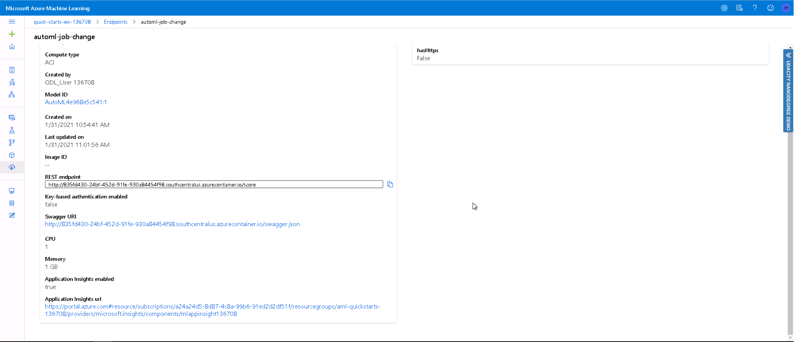

# Predict Job Change for Data Scientist using Azure Machine Learning

This purpose of this project is to build a model using the Azure Machine Learning platform and deploy it so it can be consumed using standard API functionality.

## Dataset

### Overview
The Dataset that will be used in this project is the HR job change data for Data Scientist. This data can be downloaded from Kaggle, which is a data science competition website. Refer to below link for data source and additional information.

https://www.kaggle.com/arashnic/hr-analytics-job-change-of-data-scientists

The drive for collecting the data is as follows.

*A company which is active in Big Data and Data Science wants to hire data scientists among people who successfully pass some courses which conduct by the company. Many people signup for their training. Company wants to know which of these candidates are really wants to work for the company after training or looking for a new employment because **it helps to reduce the cost and time as well as the quality of training or planning the courses and categorization of candidates**. Information related to demographics, education, experience are in hands from candidates signup and enrollment.*

### Task
The main Objective is to Predict the probability of a candidate will work for the company. 

The main features used in this model is around the candidates past history whether it being work or educational. It also includes certain demographic features which may indicate people's propensity to change jobs.

Refer to below list of all features.

**Features**

- enrollee_id : Unique ID for candidate
- city: City code
- city_ development _index : Developement index of the city (scaled)
- gender: Gender of candidate
- relevent_experience: Relevant experience of candidate
- enrolled_university: Type of University course enrolled if any
- education_level: Education level of candidate
- major_discipline :Education major discipline of candidate
- experience: Candidate total experience in years
- company_size: No of employees in current employer's company
- company_type : Type of current employer
- last*new*job: Difference in years between previous job and current job
- training_hours: training hours completed
- **target:** **0 – Not looking for job change, 1 – Looking for a job change**

### Access
The first step is to load the trainingdata into **Azure Datasets** (shown below) from either kaggle website link above or directly from this github repository **aug_train.csv**.


## Automated ML
The AutoML settings used for this project have been set to be specific for classification and timed out at 15 mins. The time is something we can change in future but setting it at 15 mins will allow more inspecting as well as providing more time to focus on setting up deployment later. Using 5 fold cross validation is a standard way to validate the results.

```python
automl_settings = {
    "experiment_timeout_minutes": 15,
    "max_concurrent_iterations": 4,
    "primary_metric" : 'accuracy',
    "n_cross_validations": 5
}
# TODO: Put your automl config here
automl_config = AutoMLConfig(compute_target=compute_target,
                             task = "classification",
                             training_data=dataset,
                             label_column_name="target", 
                             enable_early_stopping= True,
                             featurization= 'auto',
                             **automl_settings
                            )
```

### Results
Once the Automl has finalised it should look something like the below e.g it will provide a list of all the models and then rank them based on their accuracy.


From here we can see the best performing model had an Accuracy of **79.9%** and was based on a **Voting Ensemble method** of a variety of different tree based models such as **LightGBM** and **XGboost** with the associated weights as shown below.


**Best Automl Registered** 


Some improvements which could be made in future are

* Increasing the **experiment_timeout_minutes** would allow more models to be produced however it would take longer to do smaller investigations of the model input as well as testing out deployment parts in the later parts of the project.
* Finding additional data to enrich the current feature list.
* Potentially investigate class imbalance methods before using the Automl might provide better results in the end

## Hyperparameter Tuning

For the hyper-parameter tuning model I decided to use Logistic Regression because it is an effective yet simple model for understanding and results. The main Parameters I focused were the regularisation **C** (search between 0.1 and 1.0) and the maximum number of iterations **max_iter** (1000,1100,1200,1300). The max iterations I tested locally to find that it needed roughly 1000 minimum which I could then give a range to test for the tuning.

```python
# Parameter sampler
ps = RandomParameterSampling({
        "--C": uniform(0.1,1.0),  
        "--max_iter": choice(1000, 1100, 1200, 1300)
    })

# Policy
policy = BanditPolicy(slack_factor = 0.1, evaluation_interval = 1)

#polcy = MedianStoppingPolicy(evaluation_interval=1, delay_evaluation=0)

# SKLearn estimator for use with train.py
est = SKLearn(source_directory = '.', 
              compute_target = cpu_cluster, 
              entry_script = 'train.py')

# HyperDriveConfig using hyperparameter sampler, policy and estimator.
hyperdrive_config = HyperDriveConfig(estimator = est,
                                hyperparameter_sampling = ps,
                                policy = policy,
                                primary_metric_name = 'accuracy',
                                primary_metric_goal = PrimaryMetricGoal.MAXIMIZE,
                                max_total_runs = 10,
                                max_concurrent_runs = 4)
```


### Results
Once the Hyper-parameter tuning is completed it should show a range of parameter selections along with the corresponding Accuracy as shown below.


The here we can find best Accuracy for the HyperDrive model is **78.5 %** The best hyperparameters for this accuracy are:

- 'Regularization Strength:': 0.85
- 'Max iterations:': 1300


Future Improvements with Model

* Extend the number of parameter search for both **C** and **max_iter**
* Change the model to ElasticNet which is essentially blend of Ridge and Lasso based logisitic regression models
* Increase the **max_total_runs** so that model parameters are tested which may find a better final set

## Model Deployment

The AutoMl model was chosen to be deployed as it had the highest accuracy. The model is deployed using Azure Container Instance as a WebService. 

Using the score.py file provided to the InferenceConfig and setting the **Cpu_cores** and **memory_gb** to be initialized as 1 for the deployment configuration. This is the compute instance to process the prediction

The aci service is then created using workspace, aci service name, model, inference config and deployment configuration.

The model is successfully deployed as a web service and a REST endpoint is created with status Healthy. A scoring uri is also generated to test the endpoint.

The first way to test the model endpoint is to execute **endpoint.py** file. Essentially the way this works is by using the requests library in python to take JSON input and posting this request into the **scoring_uri** which is provided once you deploy the model. As you can see in below example which passes in two examples and as shown below produces an output of both 0.0.


The second way to test the endpoint is to pass data directly into the service. This can be acheived by taking a sample from data loaded into pandas. Then converting this into a JSON format to the be import directly into the service as shown below.


You can see the logs from the service by running service.get_logs()


**Endpoint Deployed Successfully**


We can also additional monitoring capabilities with Azure Machine Learning. This is achieved by activating the **Application Insights** into within notebook by running the command "service.update(enable_app_insights=**True**)". 



Now that the Application Insights is activated this provides additional monitoring measures such as checking failed requests as well as determining if the compute needs to be increased if we find an increase in activity as shown below.


Finally we can then delete the Service as we no longer need it and we can easily deploy it later.


## Screen Recording
https://youtu.be/-__4fma7U_I

## Future Improvements
* Running longer Automl models (e.g 15 mins -> 1-2 hour) will produce more models and potenially I higher performing model
* Producing more hyper-parameters which may produce a better model
* Choosing a different model than Logistic Regression for the main model to do Hyperparameter tuning
* Finding complimentary data for more information related to the people used in the HR Analytics data.
* Getting more Data may improve the performance as it will provide more examples and explanations.  