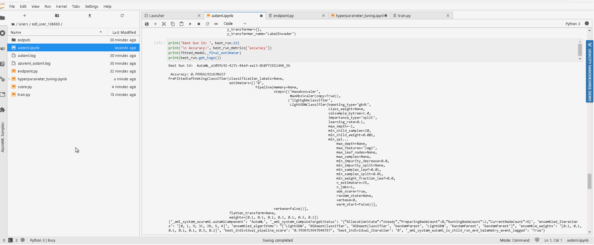

# Predict Job Change for Data Scientist using Azure Machine Learning

This purpose of this project is to build a model using the Azure Machine Learning platform and deploy it so it can be consumed using standard API functionality.

## Dataset

### Overview
*TODO*: Explain about the data you are using and where you got it from.

*A company which is active in Big Data and Data Science wants to hire data scientists among people who successfully pass some courses which conduct by the company. Many people signup for their training. Company wants to know which of these candidates are really wants to work for the company after training or looking for a new employment because **it helps to reduce the cost and time as well as the quality of training or planning the courses and categorization of candidates**. Information related to demographics, education, experience are in hands from candidates signup and enrollment.*

### Task
*TODO*: Explain the task you are going to be solving with this dataset and the features you will be using for it.

The Dataset that will be used in this project is the HR job change data for Data Scientist.  Refer to below link for data source and additional information.

https://www.kaggle.com/arashnic/hr-analytics-job-change-of-data-scientists

The main Objective is to Predict the probability of a candidate will work for the company.

**Features**

- enrollee_id : Unique ID for candidate
- city: City code
- city_ development _index : Developement index of the city (scaled)
- gender: Gender of candidate
- relevent_experience: Relevant experience of candidate
- enrolled_university: Type of University course enrolled if any
- education_level: Education level of candidate
- major_discipline :Education major discipline of candidate
- experience: Candidate total experience in years
- company_size: No of employees in current employer's company
- company_type : Type of current employer
- last*new*job: Difference in years between previous job and current job
- training_hours: training hours completed
- **target:** **0 – Not looking for job change, 1 – Looking for a job change**

### Access
*TODO*: Explain how you are accessing the data in your workspace.

The first step is to load the trainingdata from either kaggle website link above or directly from this github repository **aug_train.csv**.


## Automated ML
*TODO*: Give an overview of the `automl` settings and configuration you used for this experiment

The AutoML settings used for this project have been set to be specific for classification and timed out at 15 mins. This module but allowed for more inspection of the models.

```python
automl_settings = {
    "experiment_timeout_minutes": 15,
    "max_concurrent_iterations": 4,
    "primary_metric" : 'accuracy',
    "n_cross_validations": 5
}
# TODO: Put your automl config here
automl_config = AutoMLConfig(compute_target=compute_target,
                             task = "classification",
                             training_data=dataset,
                             label_column_name="target", 
                             enable_early_stopping= True,
                             featurization= 'auto',
                             **automl_settings
                            )
```

### Results
*TODO*: What are the results you got with your automated ML model? What were the parameters of the model? How could you have improved it?

Some improvements which could be made in future are

* Increasing the **experiment_timeout_minutes** would allow more models to be produced however it would take longer to do smaller investigations of the model input as well as testing out deployment parts in the later parts of the project.
* Finding additional data to enrich the current feature list.
* Potentially investigate class imbalance methods before using the Automl might provide better results in the end


*TODO* Remeber to provide screenshots of the `RunDetails` widget as well as a screenshot of the best model trained with it's parameters.

Once the Automl is finalised it should look something like the below e.g it will provide a list of all the models and then rank them based on their accuracy.


From here we can see the best performing model had an Accuracy of 0.799 and was based on a **Voting Ensemble method** of a variety of different tree based models such as **LightGBM** and **XGboost** with the associated weights as shown below.




**Best Automl Registered** 


## Hyperparameter Tuning

*TODO*: What kind of model did you choose for this experiment and why? Give an overview of the types of parameters and their ranges used for the hyperparameter search

For the hyperparameter tuning model I decided to use Logisitic Regression because it is an effective yet simple model for understanding and results. The main Parameters I focused were the regularisation **C** and the maxium number of iterations **max_iter**

```
# Parameter sampler
ps = RandomParameterSampling({
        "--C": uniform(0.1,1.0),  
        "--max_iter": choice(1000, 1100, 1200, 1300)
    })

# Policy
policy = BanditPolicy(slack_factor = 0.1, evaluation_interval = 1)

#polcy = MedianStoppingPolicy(evaluation_interval=1, delay_evaluation=0)

# SKLearn estimator for use with train.py
est = SKLearn(source_directory = '.', 
              compute_target = cpu_cluster, 
              entry_script = 'train.py')

# HyperDriveConfig using hyperparameter sampler, policy and estimator.
hyperdrive_config = HyperDriveConfig(estimator = est,
                                hyperparameter_sampling = ps,
                                policy = policy,
                                primary_metric_name = 'accuracy',
                                primary_metric_goal = PrimaryMetricGoal.MAXIMIZE,
                                max_total_runs = 10,
                                max_concurrent_runs = 4)
```


### Results
*TODO*: What are the results you got with your model? What were the parameters of the model? How could you have improved it?

*TODO* Remeber to provide screenshots of the `RunDetails` widget as well as a screenshot of the best model trained with it's parameters.

Future Improvements with Model

* Extend the number of parameter search for both **C** and **max_iter**
* Change the model to ElasticNet which is essentially blend of Ridge and Lasso based logisitic regression models
* Increase the **max_total_runs** so that model parameters are tested which may find a better final set


## Model Deployment

*TODO*: Give an overview of the deployed model and instructions on how to query the endpoint with a sample input.

The AutoMl model is deployed using Azure Container Instance as a WebService. Best run environment and score.py file is provided to the InferenceConfig. Cpu_cores and memory_gb are initialized as 1 for the deployment configuration. The aci service is then created using workspace, aci service name, model, inference config and deployment configuration.

The model is successfully deployed as a web service and a REST endpoint is created with status Healthy. A scoring uri is also generated to test the endpoint.


## Screen Recording
https://youtu.be/iLXH80CiqKU

## Future Improvements
* 